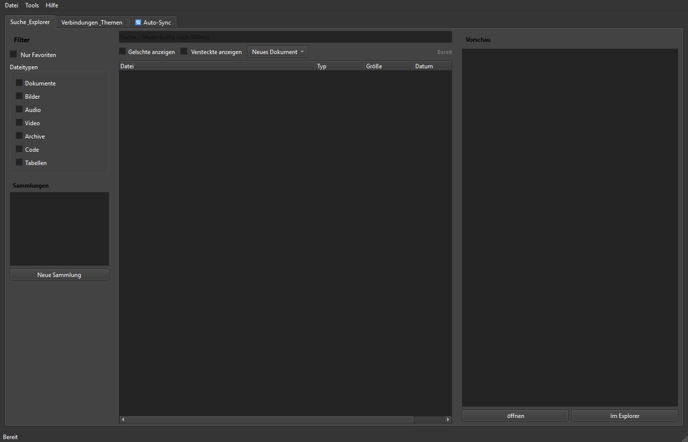

# ProFiler Suite

Professionelle Dateiverwaltung mit Volltextsuche, OCR und PDF-Bearbeitung.

## Features

- **Datei-Indexierung** mit SQLite-basiertem Index
- **Volltextsuche** ueber Dokumente (PDF, DOCX, TXT)
- **OCR** fuer gescannte Dokumente (Tesseract)
- **PDF-Viewer und -Editor** (PyMuPDF)
- **Dateiueberwachung** mit Watchdog (Auto-Sync)
- **Datenschutzampel** -- Erkennung sensibler Dateien
- **System-Tray-Integration** fuer Hintergrundbetrieb
- **Excel-Import** fuer bestehende Dateilisten
- **Berichterstellung** (PDF)

## Screenshots



## Installation

### Voraussetzungen

- Python >= 3.8
- Tesseract OCR (separat installieren oder portable Version verwenden)

### Python-Abhaengigkeiten

```bash
pip install -r requirements.txt
```

### Tesseract OCR

Die OCR-Funktionalitaet erfordert [Tesseract](https://github.com/tesseract-ocr/tesseract).
Der Pfad kann in `profiler_config.json` konfiguriert werden.

## Nutzung

```bash
python Profiler_Suite_V15.py
```

Oder ueber die Batch-Datei:

```bash
START.bat
```

## Konfiguration

| Datei | Zweck |
|-------|-------|
| `profiler_config.json` | Hauptkonfiguration (Pfade, OCR, Index) |
| `profiler_settings.json` | Benutzereinstellungen (UI, Theme) |
| `search_config.json` | Suchoptionen und Filter |

## Enthaltene Tools

| Tool | Beschreibung |
|------|--------------|
| `Profiler_Suite_V15.py` | Hauptanwendung |
| `ProFiler_Datenschutzampel.py` | Eigenstaendiger Datenschutz-Check |
| `SQLiteViewer.py` | Datenbank-Viewer fuer den Index |
| `import_excel_to_profiler.py` | Excel-Import in den Profiler-Index |
| `indent_gui_checker.py` | GUI-Einrueckungspruefer |

## Unterstuetzte Formate

| Kategorie | Formate |
|-----------|---------|
| **Dokumente** | PDF, DOCX, TXT, RTF |
| **Bilder** | PNG, JPG, TIFF (mit OCR) |
| **Tabellen** | XLSX, XLS, CSV |

## See Also: KnowledgeDigest

Looking for full-text search with BM25 ranking, LLM summarization, or a web viewer for your documents? Check out [KnowledgeDigest](https://github.com/file-bricks/knowledgedigest) -- a portable knowledge database from the same author.

| | ProFiler | KnowledgeDigest |
|---|---|---|
| **Focus** | File management, PDF tools, OCR, privacy | Knowledge search, chunking, LLM summaries |
| **Search** | Multi-DB, type/size/date filters | FTS5 with BM25 ranking, snippet highlighting |
| **PDF** | Encrypt, decrypt, extract, redact, OCR | Read-only (text extraction) |
| **Privacy** | Anonymization, redaction, clipboard guard | -- |
| **AI** | -- | LLM summarization (Haiku), keyword extraction |
| **Interfaces** | Desktop GUI, System Tray | Desktop GUI, Web Viewer, CLI, Python API |
| **License** | AGPL v3 | MIT |

## Lizenz

AGPL v3 -- Siehe [LICENSE](LICENSE)

Dieses Projekt verwendet PySide6 (LGPL) und PyMuPDF (AGPL).

---

**Version:** 15
**Autor:** Lukas Geiger
**Zuletzt aktualisiert:** Maerz 2026

---

## English

Professional file management with full-text search, OCR, and PDF editing.

### Features

- **File Indexing** with SQLite-based index
- **Full-Text Search** across documents (PDF, DOCX, TXT)
- **OCR** for scanned documents (Tesseract)
- **PDF Viewer and Editor** (PyMuPDF)
- **File Monitoring** with Watchdog (Auto-Sync)
- **Privacy Traffic Light** -- detection of sensitive files
- **System Tray Integration** for background operation
- **Excel Import** for existing file lists
- **Report Generation** (PDF)

### Screenshots


### Installation

#### Prerequisites

- Python >= 3.8
- Tesseract OCR (install separately or use the portable version)

#### Python Dependencies

```bash
pip install -r requirements.txt
```

#### Tesseract OCR

OCR functionality requires [Tesseract](https://github.com/tesseract-ocr/tesseract).
The path can be configured in `profiler_config.json`.

### Usage

```bash
python Profiler_Suite_V15.py
```

Or via the batch file:

```bash
START.bat
```

### Configuration

| File | Purpose |
|------|---------|
| `profiler_config.json` | Main configuration (paths, OCR, index) |
| `profiler_settings.json` | User settings (UI, theme) |
| `search_config.json` | Search options and filters |

### Included Tools

| Tool | Description |
|------|-------------|
| `Profiler_Suite_V15.py` | Main application |
| `ProFiler_Datenschutzampel.py` | Standalone privacy check |
| `SQLiteViewer.py` | Database viewer for the index |
| `import_excel_to_profiler.py` | Excel import into the Profiler index |
| `indent_gui_checker.py` | GUI indentation checker |

### Supported Formats

| Category | Formats |
|----------|---------|
| **Documents** | PDF, DOCX, TXT, RTF |
| **Images** | PNG, JPG, TIFF (with OCR) |
| **Spreadsheets** | XLSX, XLS, CSV |

### License

AGPL v3 -- See [LICENSE](LICENSE)

This project uses PySide6 (LGPL) and PyMuPDF (AGPL).

---

**Version:** 15
**Author:** Lukas Geiger
**Last Updated:** March 2026

> **Keine Garantie vollständiger Schwärzung/Anonymisierung.** Dieses Werkzeug unterstützt Privacy-Prozesse, kann sie aber nicht vollständig automatisieren. Manuelle Nachkontrolle ist Pflicht.
>
> **No guarantee of complete redaction/anonymization.** This tool supports privacy processes but cannot fully automate them. Manual review is required.


---

## Haftung / Liability

Dieses Projekt ist eine **unentgeltliche Open-Source-Schenkung** im Sinne der §§ 516 ff. BGB. Die Haftung des Urhebers ist gemäß **§ 521 BGB** auf **Vorsatz und grobe Fahrlässigkeit** beschränkt. Ergänzend gelten die Haftungsausschlüsse aus GPL-3.0 / MIT / Apache-2.0 §§ 15–16 (je nach gewählter Lizenz).

Nutzung auf eigenes Risiko. Keine Wartungszusage, keine Verfügbarkeitsgarantie, keine Gewähr für Fehlerfreiheit oder Eignung für einen bestimmten Zweck.

This project is an unpaid open-source donation. Liability is limited to intent and gross negligence (§ 521 German Civil Code). Use at your own risk. No warranty, no maintenance guarantee, no fitness-for-purpose assumed.

